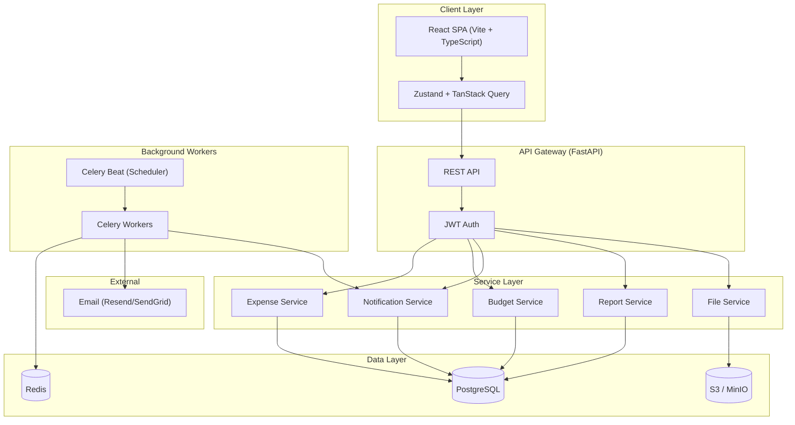
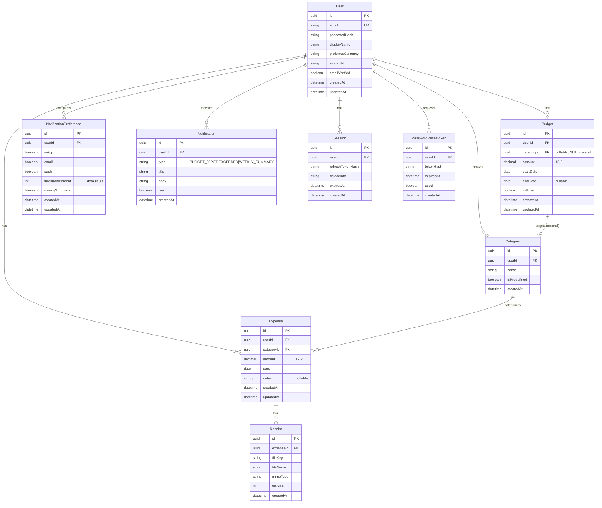
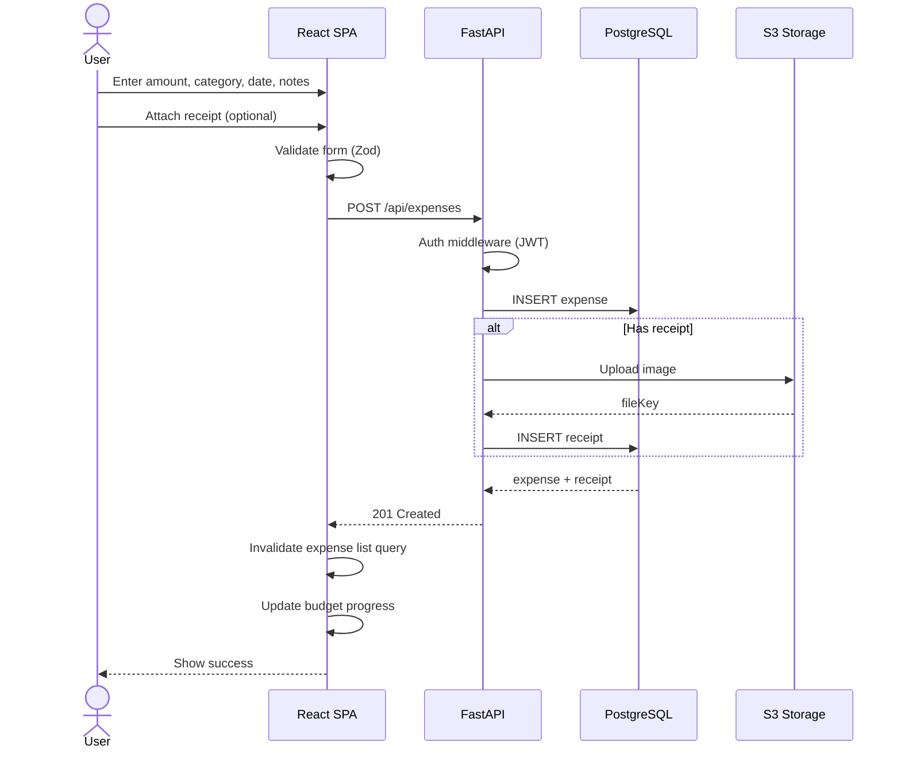
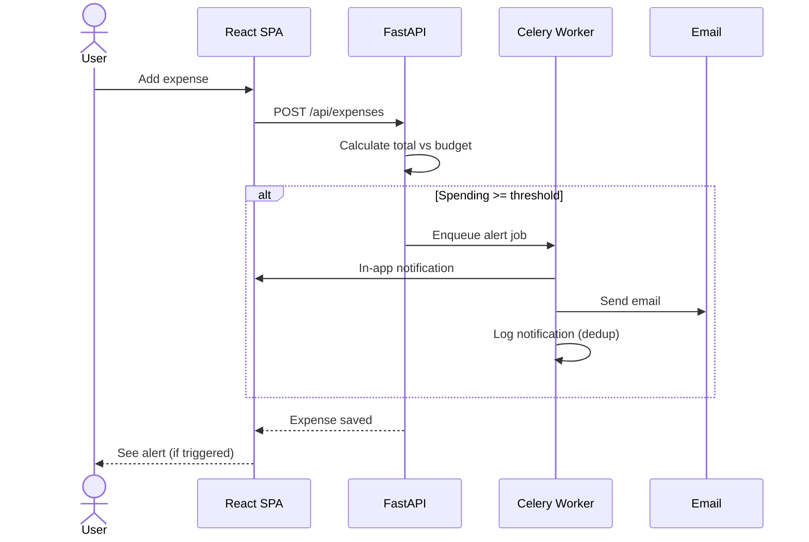

# Personal Finance (PFIN) - System Architecture

## Project Structure

```
personal-fin/
├── backend/
│   ├── app/
│   │   ├── api/              # Route handlers
│   │   ├── core/             # Config, security, deps
│   │   ├── models/           # SQLAlchemy models
│   │   ├── schemas/          # Pydantic schemas
│   │   ├── services/         # Business logic
│   │   └── tasks/            # Celery tasks
│   ├── alembic/              # DB migrations
│   ├── tests/
│   ├── requirements.txt
│   └── Dockerfile
├── frontend/
│   ├── src/
│   │   ├── components/       # Reusable UI
│   │   ├── pages/            # Route pages
│   │   ├── hooks/            # Custom hooks
│   │   ├── stores/           # Zustand
│   │   ├── api/              # Axios + TanStack Query
│   │   └── types/            # TypeScript types
│   ├── package.json
│   └── Dockerfile
├── Spec/                     # Jira story specs
│   ├── 01-Expense-Tracking/
│   ├── 02-Budget-Management/
│   ├── 03-Notifications-Alerts/
│   ├── 04-Reporting-Analytics/
│   └── 05-Auth-User-Management/
├── Docs/                     # Architecture & tech docs
│   ├── architecture.md
│   ├── tech-stack.md
│   └── database.md
├── docker-compose.yml
└── .gitignore
```

## High-Level Architecture



## Entity-Relationship Diagram



## Data Flow - Add Expense



## Data Flow - Budget Alert



## API Route Map

```
Auth
  POST   /api/auth/register
  POST   /api/auth/login
  POST   /api/auth/refresh
  POST   /api/auth/logout
  POST   /api/auth/forgot-password
  POST   /api/auth/reset-password

Profile
  GET    /api/profile
  PUT    /api/profile
  DELETE /api/profile
  PUT    /api/profile/avatar

Expenses
  GET    /api/expenses              # Paginated, filterable, sortable
  POST   /api/expenses
  GET    /api/expenses/:id
  PUT    /api/expenses/:id
  DELETE /api/expenses/:id
  POST   /api/expenses/:id/receipts
  DELETE /api/expenses/:id/receipts/:receiptId

Categories
  GET    /api/categories
  POST   /api/categories
  PUT    /api/categories/:id
  DELETE /api/categories/:id

Budgets
  GET    /api/budgets
  PUT    /api/budgets/overall
  PUT    /api/budgets/category/:categoryId

Reports
  GET    /api/reports/monthly?month=&year=
  GET    /api/reports/trends?period=7d|30d|12m
  GET    /api/reports/comparison?monthA=&monthB=
  GET    /api/reports/export?format=csv|pdf&from=&to=

Notifications
  GET    /api/notifications
  PUT    /api/notifications/:id/read
  GET    /api/notifications/preferences
  PUT    /api/notifications/preferences
```
