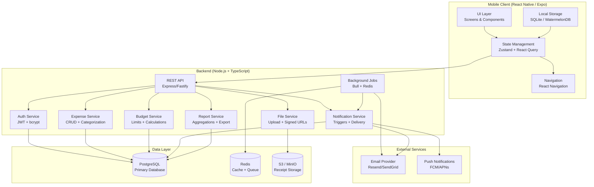
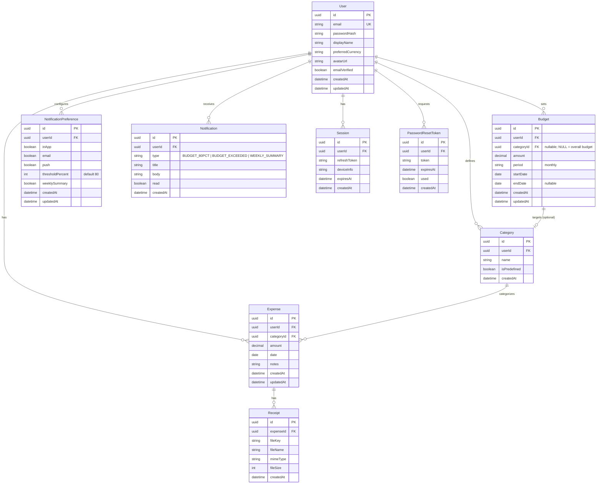
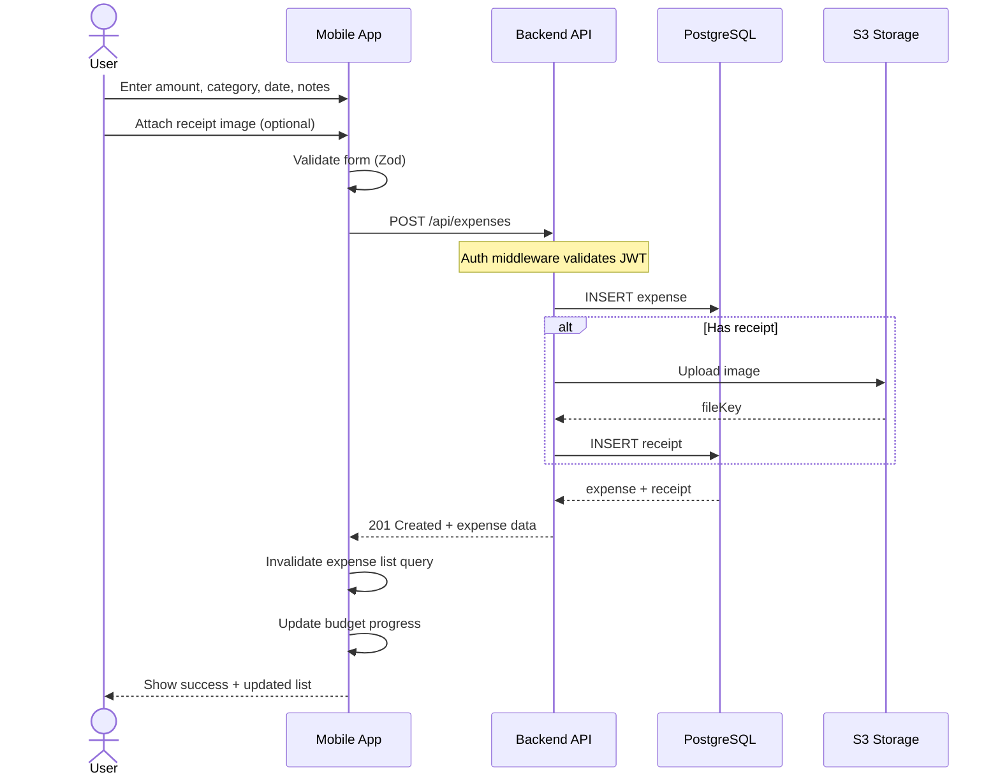
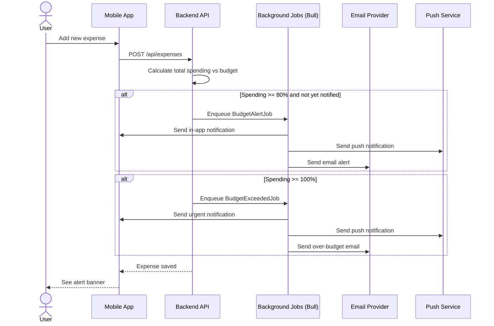

# Personal Finance (PFIN) - System Architecture

## High-Level Architecture



## Entity-Relationship Diagram



## Data Flow - Add Expense



## Data Flow - Budget Alert (80% / 100%)



## API Route Map

```
Auth
  POST   /api/auth/register          # User registration
  POST   /api/auth/login             # Login
  POST   /api/auth/refresh           # Refresh JWT
  POST   /api/auth/logout            # Logout (invalidate refresh token)
  POST   /api/auth/forgot-password   # Request password reset email
  POST   /api/auth/reset-password    # Reset password with token

Profile
  GET    /api/profile                # Get current user profile
  PUT    /api/profile                # Update profile
  DELETE /api/profile                # Delete account
  PUT    /api/profile/avatar         # Upload avatar

Expenses
  GET    /api/expenses               # List (paginated, filterable, sortable)
  POST   /api/expenses               # Create expense
  GET    /api/expenses/:id           # Get expense detail
  PUT    /api/expenses/:id           # Update expense
  DELETE /api/expenses/:id           # Delete expense
  POST   /api/expenses/:id/receipts  # Attach receipt
  DELETE /api/expenses/:id/receipts/:receiptId  # Remove receipt

Categories
  GET    /api/categories             # List all categories for user
  POST   /api/categories             # Create custom category
  PUT    /api/categories/:id         # Update category
  DELETE /api/categories/:id         # Delete category (if unused)

Budgets
  GET    /api/budgets                # Get budgets (overall + per-category)
  PUT    /api/budgets/overall        # Set overall monthly budget
  PUT    /api/budgets/category/:id   # Set per-category budget

Reports
  GET    /api/reports/monthly?month=&year=  # Monthly breakdown
  GET    /api/reports/trends?period=7d|30d|12m  # Trend data
  GET    /api/reports/comparison?monthA=&monthB=  # MoM comparison
  GET    /api/reports/export?format=csv|pdf&from=&to=  # Export data

Notifications
  GET    /api/notifications          # List notifications (paginated)
  PUT    /api/notifications/:id/read # Mark as read
  GET    /api/notifications/preferences  # Get preferences
  PUT    /api/notifications/preferences  # Update preferences
```
